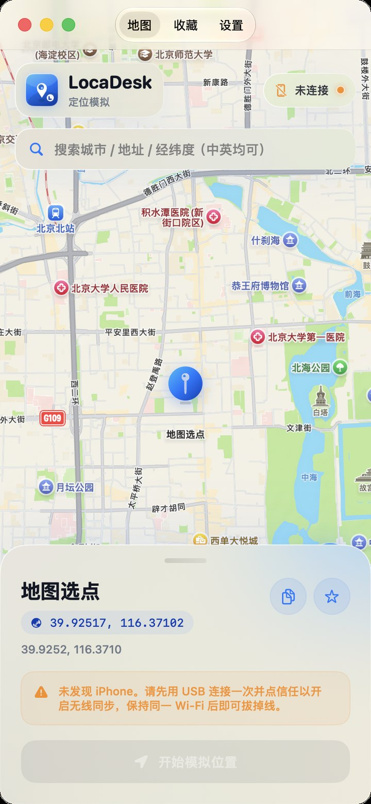
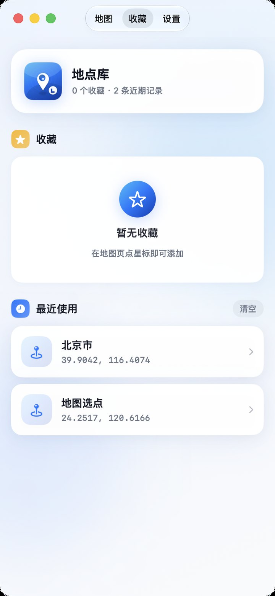
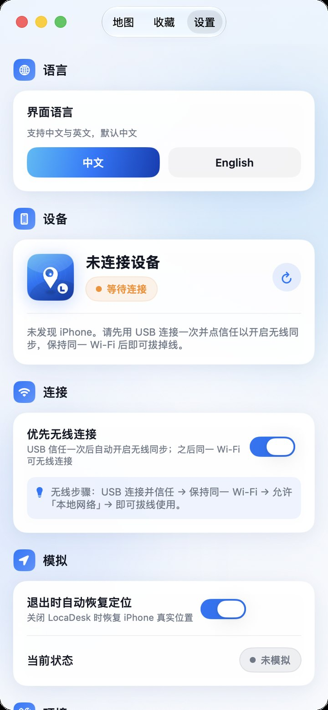

# LocaDesk

**iPhone 定位模拟工具（macOS）**

> 打开软件 → 连接 iPhone → 地图选点 → 一键模拟 / 恢复。

本仓库 **不包含源码**，仅提供产品介绍、截图与发布包下载。

## 下载

- 最新版本：**v1.0.7** → [Releases](https://github.com/linux503/LocaDesk/releases/latest)
- 安装包：`LocaDesk-1.0.7.dmg`
- 官网页面：[https://linux503.github.io/LocaDesk/](https://linux503.github.io/LocaDesk/)
- 版本清单：[`version.json`](./version.json)（App 内「检查更新」读取此文件）

## 截图

| 地图 | 收藏 | 设置 |
| --- | --- | --- |
|  |  |  |

## 功能

- 搜索城市 / 地址 / 经纬度（中英均可）
- 地图点选模拟定位，一键恢复真实位置
- USB / 同一 Wi‑Fi 连接（需开发者模式）
- 收藏与历史
- 中英双语（默认中文）
- 应用内检查更新

## 使用前准备

1. macOS 14+
2. 安装：`pip3 install -U pymobiledevice3`
3. iPhone 开启 **开发者模式**（设置 → 隐私与安全性）
4. USB 连接并点「信任」；无线需同一 Wi‑Fi，并允许「本地网络」

## 系统要求

- macOS 14.0+
- iPhone（建议 iOS 17+ 使用 pymobiledevice3 路径）

## 说明

LocaDesk 仅用于开发 / 测试场景的定位模拟。请遵守当地法律法规与平台政策。

## License

Proprietary. All rights reserved.
